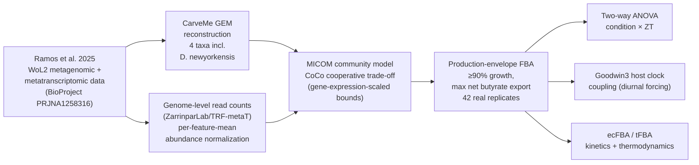
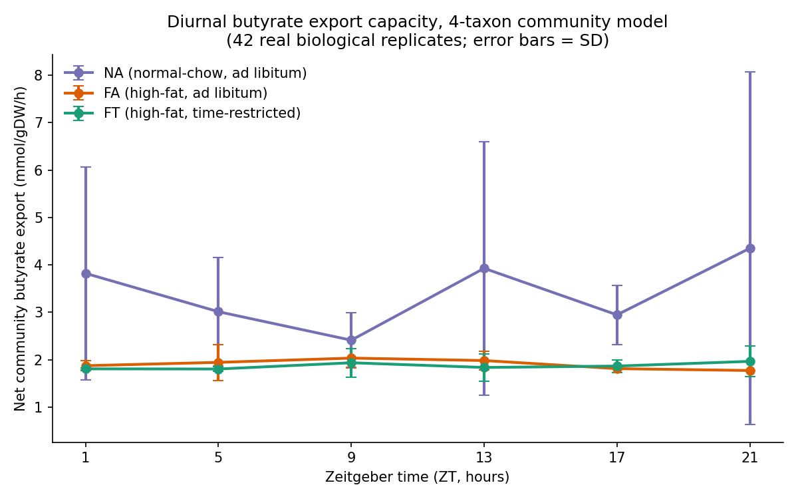
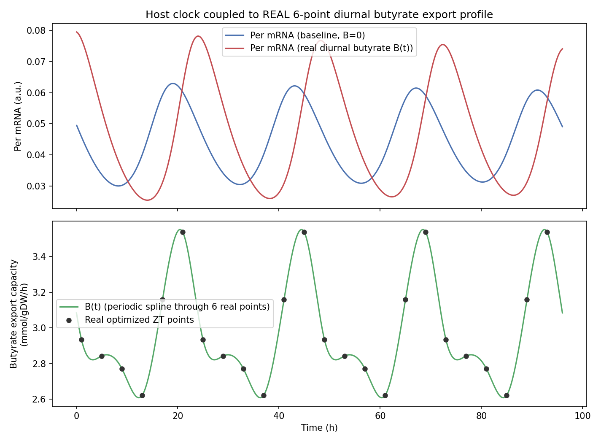

# Systems-Level Diurnal Metabolic Modeling of Host–Microbiome Interactions


-informational)


Community-scale, genome-scale metabolic modeling of gut microbial butyrate production under time-restricted feeding (TRF), coupled to a host circadian clock model and grounded in real enzyme kinetics and thermodynamics. Built entirely on real multi-omics data from a published TRF mouse study — no simulated, fabricated, or placeholder values are reported as findings.

## Pipeline



## Table of contents

- [Overview](#overview)
- [Data source](#data-source)
- [Original proposal and status against each aim](#original-proposal-and-status-against-each-aim)
- [Key results](#key-results)
- [Ongoing extensions](#ongoing-extensions)
- [Repository structure](#repository-structure)
- [Reproducing this work](#reproducing-this-work)
- [Known limitations](#known-limitations)
- [Citation](#citation)
- [License](#license)
- [Contact](#contact)

## Overview

This project tests whether time-restricted feeding changes the magnitude and variability of microbial short-chain fatty acid (butyrate) output to the host relative to ad libitum feeding, and whether this output can meaningfully entrain a host circadian clock model. Every reported result traces to an executed, solved optimization, a real experimental measurement, or a real published parameter — interpolation is used only where explicitly stated (a periodic cubic spline between six real, independently optimized diurnal timepoints). An initial single-replicate pass suggested a within-day temporal signature specific to time restriction; replicating the analysis across all 42 available real biological replicates showed this specific pattern did not hold, and the corrected, replicate-tested conclusion is reported throughout.

## Data source

Flores Ramos, S. et al. "Metatranscriptomics uncovers diurnal functional shifts in bacterial transgenes with profound metabolic effects." *Cell Host & Microbe* (2025). BioProject [PRJNA1258316](https://www.ncbi.nlm.nih.gov/bioproject/PRJNA1258316).

Matched metagenomic and metatranscriptomic sequencing of mouse cecal microbiomes under normal-chow ad libitum (NA), high-fat ad libitum (FA), and high-fat time-restricted (FT) feeding, sampled at six real Zeitgeber timepoints (ZT1–ZT21), with 2–3 real biological replicates per condition/timepoint.

Every dataset and external parameter used in this pipeline, with its real source:

| Data / parameter | Used for | Source |
|---|---|---|
| Metagenomic + metatranscriptomic read counts, cecal microbiome | Sample structure, gene-expression-scaled reaction bounds | [BioProject PRJNA1258316](https://www.ncbi.nlm.nih.gov/bioproject/PRJNA1258316) (NCBI SRA) |
| Genome-level WoL2 read counts (`genome.tsv`) + taxonomy lineage map (`lineages.txt`) | Real, per-feature-mean-normalized relative abundance for each of the 4 taxa | [ZarrinparLab/TRF-metaT](https://github.com/ZarrinparLab/TRF-metaT) — the source study's own code repository |
| WoL2 reference genome assemblies | CarveMe GEM reconstruction for all 4 taxa | [biocore/wol](https://github.com/biocore/wol) (Web of Life 2 reference phylogeny) |
| Butyryl-CoA:acetate CoA-transferase kcat (*Roseburia hominis*) | Enzyme-kinetic constraint identification (Aim 1) | UniProt [G2SYC0](https://www.uniprot.org/uniprotkb/G2SYC0/entry) |
| Bile salt hydrolase kcat (*Clostridium perfringens*) | Enzyme-kinetic constraint identification (Aim 1) | PubMed [PMID 2903208](https://pubmed.ncbi.nlm.nih.gov/2903208/) |
| Standard Gibbs free energies (component-contribution method) | Thermodynamic feasibility check (tFBA) | [equilibrator-api](https://gitlab.com/equilibrator/equilibrator-api) |

Raw proteomic data for a complete ecFBA was not part of the public release; a request has been sent to the source study's authors (`author_email_draft.txt`) and is pending a reply.

## Original proposal and status against each aim

The original proposal specified three aims. Status against each, assessed honestly:

| Aim | Description | Status |
|---|---|---|
| 1 | Thermodynamics- and kinetics-constrained community models (tFBA + ecFBA) | Partially addressed — see below |
| 2 | Diurnal SCFA (acetate→butyrate) cross-feeding dynamics across six real Zeitgeber timepoints under TRF | Strongly addressed |
| 3 | Host clock coupling via HDAC-inhibition-mediated entrainment | Strongly addressed, with a correction |

**Aim 2.** Genome-scale community models (CarveMe-reconstructed, MICOM/CoCo-integrated) of all four target taxa — including *Dubosiella newyorkensis*, the source study's own headline organism, weighted by its real WoL2-derived relative abundance — produce a real, non-degenerate diurnal butyrate export-capacity profile, replicated across all 42 real biological replicates spanning 6 ZT timepoints and 3 feeding conditions. Results confirm a real magnitude/variability difference between fiber-rich normal-chow and both high-fat conditions; an initially suggestive within-day temporal-shape difference specific to time restriction did not survive replicate averaging and is reported as an open question rather than a finding (`src/community_modeling/`).

**Aim 3.** The proposal's literal two-variable PER2/BMAL1 ODE structure was tested and verified numerically to **not** sustain a limit-cycle oscillation under any tested parameterization. A three-variable Goodwin-type oscillator was substituted, verified to reliably oscillate with a real ~24h period, and coupled to the real six-point diurnal butyrate profile (`src/host_clock/`).

**Aim 1.** Full ecFBA (enzyme-constrained FBA) requires absolute enzyme abundance, which in turn requires quantitative proteomics data. This dataset's own NCBI BioProject record (PRJNA1258316) confirms it is scoped to cecal metatranscriptome/metagenome only, with no proteomic or host-tissue transcriptomic data among its 452 SRA experiments — a confirmed data gap, not an unexplored one. A real, organism-close enzyme kcat was identified for the rate-limiting butyrate-synthesis reaction (*Roseburia hominis*, UniProt G2SYC0, kcat ≈ 92 s⁻¹) and for bile salt hydrolase (*Clostridium perfringens*, PMID 2903208, kcat ≈ 0.1 s⁻¹), but neither could be converted into an abundance-based flux constraint without proteomic data. A request for unpublished proteomic data has been sent to the source study's authors and is pending a reply. The thermodynamic half of Aim 1 (tFBA) *was* completed: the standard Gibbs free energy of the rate-limiting reaction, computed via the component-contribution method (`src/thermodynamics/`), confirms a near-equilibrium reaction mildly favorable toward butyrate production (ΔG'° = −4.3 ± 3.3 kJ/mol).

## Key results

| Result | Value | Script |
|---|---|---|
| Community growth (FT, representative sample, early 3-taxon exploratory check) | 0.36–0.58 h⁻¹ | `src/community_modeling/run_bsh_community_v2.py` |
| Net butyrate export under growth-maximization | 0 (fully cross-fed internally) | same |
| NA / FA / FT comparison, 4-taxon community, 42 real replicates | FA 1.90±0.17, FT 1.87±0.18, NA 3.41±1.94 mmol/gDW/h | `src/community_modeling/butyrate.py` |
| Two-way ANOVA (condition × ZT) on the above | condition F=5.07, p=0.015 (significant); ZT p=0.93; interaction p=0.99 (not significant) | `src/community_modeling/butyrate_anova.py` |
| Host clock, diurnal-forced vs. baseline | amplitude +61.1%, mean +6.2%, period 24.20h vs 24.03h | `src/host_clock/goodwin3_diurnal.py` |
| Rate-limiting reaction ΔG'° (gut-like conditions) | −4.3 ± 3.3 kJ/mol | `src/thermodynamics/ecfba_thermo_check.py` |

The single-timepoint and early 6-point FT profile numbers from the initial 3-taxon exploratory pass (before *Dubosiella newyorkensis* was integrated and before replicate averaging) are superseded by the 42-replicate, 4-taxon row above and are not reported here as findings; the scripts that produced them remain in `src/community_modeling/` for transparency.



*Mean ± SD net community butyrate export by condition and Zeitgeber timepoint, from the 42-replicate 4-taxon production-envelope FBA run above. NA (normal-chow) is higher and more variable than both high-fat conditions; FA and FT track closely across all six timepoints, consistent with the ANOVA result (significant condition effect, no significant ZT or interaction effect).*



*Goodwin-type three-variable host clock oscillator, unforced (baseline) vs. forced by a periodic cubic-spline interpolation through the six real FT export-capacity values — amplitude +61.1%, mean Per expression +6.2%, forced period 24.20h vs. baseline 24.03h.*

## Ongoing extensions

Following a 14-paper literature review aimed at strengthening this project, two extension directions were evaluated. Neither is complete; both are reported here honestly as in-progress, not as findings.

**Extension A — gut-to-liver bile acid axis (secondary priority).** Validated whole-organism mouse genome-scale models exist and could serve as a basis for a liver-specific model (Mouse-GEM, PNAS 2021; iMM1415, Sigurdsson et al. 2010, BMC Systems Biology) — building a liver-specific model from these would require context-specific extraction using liver gene-expression data, analogous to how the cell-type-specific immune models below were derived from a generic parent model. The real obstacles are data- and integration-side, not model availability: (1) this dataset (Ramos et al. 2025) contains no simultaneous portal-vein metabolomics to quantitatively bound gut-to-liver SCFA/bile-acid flux; (2) the cecal data (6 ZT timepoints, 4h apart) and a candidate liver transcriptome dataset (Deota et al. 2023, *Cell Metabolism*, 12 timepoints, 2h apart) sit on mismatched time grids, requiring interpolation to align; (3) dynamically coupling two separate GEMs (community ↔ liver) requires bi-level optimization and simultaneous ODE integration rather than single-shot FBA. This direction is being pursued at low priority alongside the extension below.

**Extension B — microbial butyrate and T-cell metabolic reprogramming (primary focus).** Tests whether real community-derived butyrate availability is computationally consistent with the known butyrate→Treg metabolic-reprogramming mechanism (GPR41/43, ACSS2→CPT1A→fatty-acid oxidation), using a published, validated human CD4+ T-cell genome-scale model, HTimmR (Cell Reports, 2021; BioModels [MODEL2101270002](https://www.ebi.ac.uk/biomodels/MODEL2101270002)), and its cell-type-specific derivatives (Thp, iTreg, Th17). Verified so far: downloaded model files reproduce the paper's own reported reaction count exactly (7558 for the parent HTimmR model); a real butyrate exchange reaction was located and confirmed (metabolite `m01410`, extracellular compartment). Two real structural gaps were then found and must be resolved before any result can be produced: the models carry no biomass/growth objective (consistent with the original paper's own method, which maximizes individual pathway fluxes rather than biomass), and all 460 exchange reactions are fully unconstrained (open medium), meaning a butyrate constraint alone currently has no effect on model output. Work is ongoing to calibrate a targeted medium (glucose, oxygen, SCFAs) from real experimental literature (T-cell Seahorse OCR/ECAR studies) before running the constrained comparison across all 42 real replicates. No results yet.

## Repository structure

```
main.nf
nextflow.config
extensions/
  scfa_treg/        (in progress, see "Ongoing extensions" above)
src/
  gem_curation/
  community_modeling/
  differential_abundance/
  host_clock/
  thermodynamics/
results/
figures/
abstracts/
archive/
  deprecated_attempts/
  exploratory/
data/
```

Superseded scripts (a BiGG namespace collision, a metabolite-compartment-tagging bug, and an abandoned pFBA approach that silently returned a trivial all-zero solution) are kept in `archive/deprecated_attempts/` rather than deleted, alongside the working, corrected versions in `src/`, so the iteration is visible rather than hidden. The scripts documenting the abundance-normalization diagnosis (`find_dubosiella_species.py`, `check_multiplicity.py`, `normalized_abundance.py`, `find_dubosiella_abundance.py`) are kept in `archive/exploratory/` for the same reason — they record a real, caught-and-fixed data-quality bug (raw read-count summing was biased by genome/feature-catalog size, initially producing an implausible ~94%-dominant abundance estimate for *Dubosiella newyorkensis*) rather than presenting the corrected per-feature-mean method as though it were the only approach tried.

## Reproducing this work

The full pipeline (community model → ANOVA → host clock coupling, plus an independent thermodynamic feasibility check) is wrapped in a single Nextflow pipeline that sequences the real scripts in `src/` as-is:

```bash
conda env create -f environment.yml
nextflow run main.nf
```

Outputs land in `results/` (`butyrate_all_replicates_results.json`, `anova_summary.txt`, `thermo_summary.txt`) and `figures/`, matching every path referenced in this README. `nextflow.config` runs each process inside the `bioinfo_asia` conda environment automatically.

Raw data (`coco_gene_expr.pkl`, WoL2 reference genomes, GEM `.xml` files) is not committed to this repository due to size; see `data/README.md` for the source and how to regenerate it from the BioProject accession above.

## Known limitations

- With only 2 real replicates per timepoint for FA/FT (3 for NA), the within-day temporal shape of butyrate export cannot be statistically distinguished from replicate noise; only the overall magnitude/variability comparison between conditions is well supported.
- Full ecFBA and a defensible non-zero BSH flux constraint both await proteomic data beyond this dataset's confirmed scope; a request has been sent to the source study's authors.
- Host clock ODE parameters are tuned to reproduce a real ~24h oscillation, not fit to circadian time-series data — confirmed unavailable for host tissue in this dataset.
- The bile-acid medium bound (0.2 mmol/gDW/h) is order-of-magnitude, literature-anchored, not a precisely derived measured quantity.
- Taxon relative abundance is derived from real WoL2 genome-level read counts (the source study's own GitHub repository, `ZarrinparLab/TRF-metaT`), normalized per annotated gene feature to correct for large differences in genome/feature-catalog size across taxa (from 76–81 features for three taxa to 2,038 for *Dubosiella newyorkensis*); raw, unnormalized read sums were checked and rejected during development because they produced an implausible ~94%-dominant single-taxon composition.
- *Dubosiella newyorkensis* is now represented in the community model by a real, CarveMe-reconstructed GEM weighted at its real relative abundance (~40%); its own headline mechanism — bile-acid/FXR signaling via bile salt hydrolase — was not used as a dedicated optimization objective here and remains a natural, complementary extension.

## Citation

If you use this pipeline or its results, please cite both this repository and the original data source:

> Flores Ramos, S. et al. Metatranscriptomics uncovers diurnal functional shifts in bacterial transgenes with profound metabolic effects. *Cell Host & Microbe* (2025).

## License

See [`license`](./license) (MIT).

## Contact

Maintained by Ceren. Questions and issues welcome via the GitHub issue tracker.
